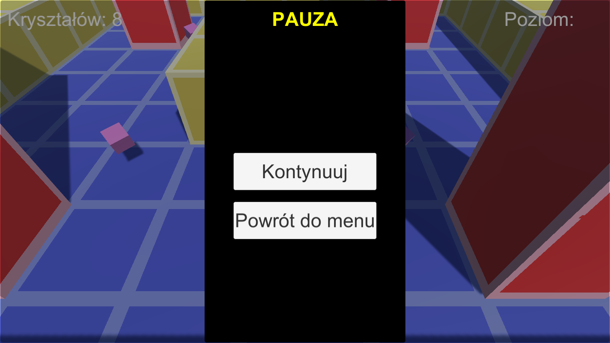
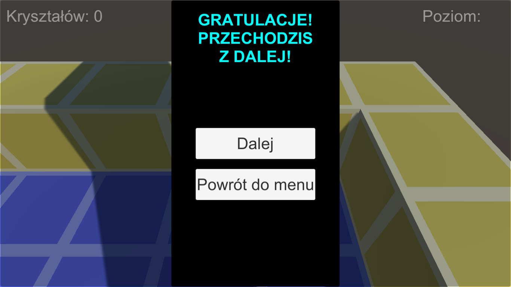

# AMazedAdVentUrer

## What's new?

There is no new features.

## About project

A Hopmon-style game made with Unity3D for PC (Windows).

Screenshots below:

## Technologies used in the project

* Unity 3D (v4/v5)

## Goals

Developing my skills with game designing and programming.

## License

My project is under BSD-2-Clause license. You can use some parts from my code but remember to credit me as an appreciation to my work! Thanks! Awoo!

© 2022 Paweł "Wilczeq/Vlk" Turoń
